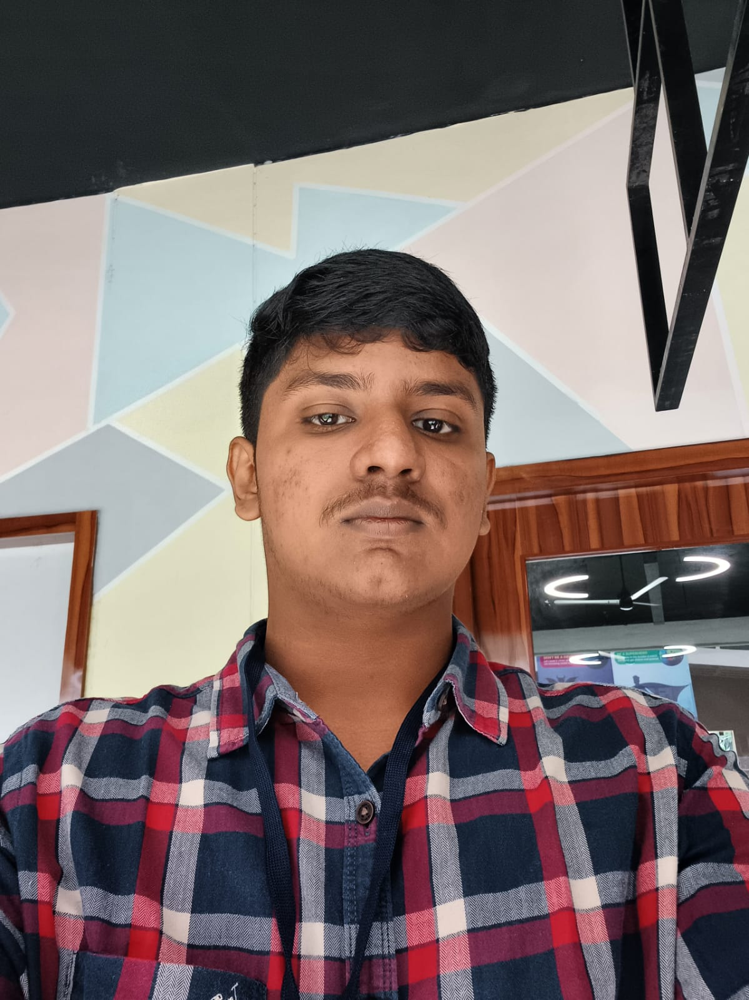

# Ex01 Portfolio
## Date:27/07/26

## AIM
To create a Portfolio using HTML and CSS.

## ALGORITHM
### STEP 1
Create an HTML file (index.html)

### STEP 2
Create a CSS file (style.css)

### STEP 3
Include a navigation bar with links to different sections.

### STEP 4
Add structured sections for introduction, about, projects, and contact details.

### STEP 5
Define global styles for fonts, colors, and layout.

### STEP 6
Style the header, navigation bar, and sections.

### STEP 7
Use Flexbox or CSS Grid for layout design.

### STEP 8
Add hover effects and transitions for interactivity.

### STEP 9
Add Images and Media.

### STEP 10
Use optimized images for a professional look.

### STEP 11
Open the HTML file in a browser to check layout and functionality.

### STEP 12
Fix styling issues and refine content placement.

### STEP 13
Deploy the Portfolio.

### STEP 14
Upload to GitHub Pages for free hosting.

## PROGRAM :
index.html
```
<!DOCTYPE html>
<html lang="en">
<head>
  <meta charset="UTF-8">
  <meta name="viewport" content="width=device-width, initial-scale=1.0">
  <meta name="description" content="Levin Paul David - AI & Software Developer Portfolio">
  <title>Levin Paul David | AI & Software Developer</title>
  <link rel="stylesheet" href="css/style.css">
  <link rel="preconnect" href="https://fonts.googleapis.com">
  <link rel="preconnect" href="https://fonts.gstatic.com" crossorigin>
  <link href="https://fonts.googleapis.com/css2?family=Inter:wght@400;500;600;700;800&display=swap" rel="stylesheet">
</head>
<body>

  <div id="cursor-glow"></div>

  <header class="navbar" id="navbar">
    <div class="container nav-container">
      <a href="#" class="logo">LPD</a>
      <nav class="nav-links" id="nav-links">
        <a href="#about">About</a>
        <a href="#skills">Skills</a>
        <a href="#projects">Projects</a>
        <a href="#contact">Contact</a>
      </nav>
      <button class="menu-toggle" id="menu-toggle" aria-label="Toggle navigation">
        <span></span><span></span><span></span>
      </button>
    </div>
  </header>

  <main>

    <!-- ===== HERO ===== -->
    <section class="hero" id="hero">
      <div class="container hero-container">
        <div class="hero-content fade-in">
          <div class="profile-img-wrapper">
            
          </div>
          <h1 class="hero-title">Levin Paul David</h1>
          <p class="hero-subtitle">AI &amp; Software Developer</p>
          <p class="hero-desc">
            Passionate about building intelligent software, cybersecurity solutions, and real-world AI applications.
          </p>
          <div class="hero-buttons">
            <a href="#projects" class="btn btn-primary">View Projects</a>
            <a href="#contact" class="btn btn-secondary">Contact Me</a>
          </div>
        </div>
      </div>
    </section>

    <!-- ===== ABOUT ===== -->
    <section class="section about" id="about">
      <div class="container">
        <h2 class="section-title fade-in">About Me</h2>
        <div class="about-content fade-in">
          <p>
            I'm a developer focused on building practical, intelligent software that solves real problems.
            My work spans artificial intelligence, cybersecurity, and full-stack development — with a strong
            interest in how software intersects with hardware and automotive systems.
          </p>
          <p>
            I enjoy working on AI-driven tools, automation, and secure systems. Whether it's integrating
            local LLMs, building APIs, or exploring vehicle communication protocols, I'm driven by curiosity
            and a desire to create products that are both functional and impactful.
          </p>
          <p>
            Outside of code, I'm deeply interested in automotive technology, cybersecurity research,
            and the future of intelligent systems in everyday life.
          </p>
        </div>
      </div>
    </section>

    <!-- ===== SKILLS ===== -->
    <section class="section skills" id="skills">
      <div class="container">
        <h2 class="section-title fade-in">Skills</h2>
        <div class="skills-grid fade-in">

          <div class="skill-card">
            <h3 class="skill-category">Programming</h3>
            <ul class="skill-list">
              <li>Python</li>
              <li>Java</li>
              <li>C</li>
              <li>HTML</li>
              <li>CSS</li>
              <li>JavaScript</li>
            </ul>
          </div>

          <div class="skill-card">
            <h3 class="skill-category">AI & Development</h3>
            <ul class="skill-list">
              <li>AI Application Development</li>
              <li>Prompt Engineering</li>
              <li>Local LLM Integration</li>
              <li>API Integration</li>
              <li>Automation</li>
              <li>Git &amp; GitHub</li>
            </ul>
          </div>

          <div class="skill-card">
            <h3 class="skill-category">Concepts</h3>
            <ul class="skill-list">
              <li>Cybersecurity Fundamentals</li>
              <li>Software Design</li>
              <li>Problem Solving</li>
            </ul>
          </div>

        </div>
      </div>
    </section>

    <!-- ===== PROJECTS ===== -->
    <section class="section projects" id="projects">
      <div class="container">
        <h2 class="section-title fade-in">Projects</h2>
        <div class="projects-grid fade-in">

          <div class="project-card">
            <h3 class="project-title">SecureCAN</h3>
            <p class="project-desc">
              An AI-powered vehicle cybersecurity platform focused on CAN Bus monitoring, vehicle diagnostics,
              attack detection, predictive maintenance and privacy-first automotive security.
            </p>
            <div class="project-tech">
              <span>Python</span><span>FastAPI</span><span>CAN Bus</span><span>OpenDBC</span><span>AI</span>
            </div>
            <a href="#" class="btn btn-outline project-link">GitHub</a>
          </div>

          <div class="project-card">
            <h3 class="project-title">AI Cybersecurity Platform</h3>
            <p class="project-desc">
              An intelligent cybersecurity assistant capable of detecting vulnerabilities, analysing threats
              and helping improve application security using AI-driven techniques.
            </p>
            <div class="project-tech">
              <span>Python</span><span>LLMs</span><span>FastAPI</span><span>Automation</span>
            </div>
            <a href="#" class="btn btn-outline project-link">GitHub</a>
          </div>

          <div class="project-card">
            <h3 class="project-title">ChargeOne</h3>
            <p class="project-desc">
              Contributed to a project EV charging platform focused on simplifying electric vehicle charging with a clean software
              experience and scalable backend architecture.
            </p>
            <div class="project-tech">
              <span>Python</span><span>JavaScript</span><span>APIs</span>
            </div>
            <a href="#" class="btn btn-outline project-link">GitHub</a>
          </div>

        </div>
      </div>
    </section>

    <!-- ===== CONTACT ===== -->
    <section class="section contact" id="contact">
      <div class="container">
        <h2 class="section-title fade-in">Contact</h2>
        <div class="contact-content fade-in">
          <p class="contact-text">
            Have a question, project idea, or just want to connect? Feel free to reach out.
          </p>
          <div class="contact-links">
            <a href="mailto:your.email@example.com" class="contact-item">
              <span class="contact-icon">✉</span>
              <span>your.email@example.com</span>
            </a>
            <a href="https://github.com/yourusername" target="_blank" rel="noopener noreferrer" class="contact-item">
              <span class="contact-icon">⌨</span>
              <span>GitHub</span>
            </a>
            <a href="https://linkedin.com/in/yourusername" target="_blank" rel="noopener noreferrer" class="contact-item">
              <span class="contact-icon">🔗</span>
              <span>LinkedIn</span>
            </a>
          </div>
          <a href="#" class="btn btn-primary resume-btn">Download Resume</a>
        </div>
      </div>
    </section>

  </main>

  <!-- ===== FOOTER ===== -->
  <footer class="footer">
    <div class="container">
      <p>&copy; 2026 Levin Paul David</p>
    </div>
  </footer>

  <script src="js/script.js"></script>
</body>
</html>

```
style.css
```
/* ===== RESET & BASE ===== */
*, *::before, *::after {
  margin: 0;
  padding: 0;
  box-sizing: border-box;
}

html {
  scroll-behavior: smooth;
  scroll-padding-top: 70px;
}

body {
  font-family: 'Inter', -apple-system, BlinkMacSystemFont, 'Segoe UI', sans-serif;
  background: #07070d;
  color: #e0e0e0;
  line-height: 1.7;
  min-height: 100vh;
  overflow-x: hidden;
}

a {
  text-decoration: none;
  color: inherit;
}

ul {
  list-style: none;
}

img {
  max-width: 100%;
  display: block;
}

.container {
  max-width: 1100px;
  margin: 0 auto;
  padding: 0 24px;
}

/* ===== CURSOR GLOW ===== */
#cursor-glow {
  position: fixed;
  width: 400px;
  height: 400px;
  border-radius: 50%;
  background: radial-gradient(circle at center, rgba(0, 212, 255, 0.06), transparent 70%);
  pointer-events: none;
  transform: translate(-50%, -50%);
  z-index: 0;
  transition: opacity 0.3s;
}

/* ===== NAVBAR ===== */
.navbar {
  position: fixed;
  top: 0;
  left: 0;
  width: 100%;
  z-index: 1000;
  padding: 16px 0;
  background: rgba(7, 7, 13, 0.8);
  backdrop-filter: blur(16px);
  -webkit-backdrop-filter: blur(16px);
  border-bottom: 1px solid rgba(255, 255, 255, 0.04);
  transition: background 0.3s;
}

.nav-container {
  display: flex;
  justify-content: space-between;
  align-items: center;
}

.logo {
  font-size: 1.5rem;
  font-weight: 800;
  color: #00d4ff;
  letter-spacing: 2px;
  user-select: none;
}

.nav-links {
  display: flex;
  gap: 32px;
}

.nav-links a {
  font-size: 0.9rem;
  font-weight: 500;
  color: #a0a0b0;
  transition: color 0.3s;
  position: relative;
}

.nav-links a::after {
  content: '';
  position: absolute;
  bottom: -4px;
  left: 0;
  width: 0;
  height: 2px;
  background: #00d4ff;
  transition: width 0.3s;
}

.nav-links a:hover {
  color: #00d4ff;
}

.nav-links a:hover::after {
  width: 100%;
}

.menu-toggle {
  display: none;
  flex-direction: column;
  gap: 5px;
  background: none;
  border: none;
  cursor: pointer;
  padding: 4px;
}

.menu-toggle span {
  display: block;
  width: 24px;
  height: 2px;
  background: #e0e0e0;
  border-radius: 2px;
  transition: 0.3s;
}

.menu-toggle.active span:nth-child(1) {
  transform: rotate(45deg) translate(5px, 5px);
}

.menu-toggle.active span:nth-child(2) {
  opacity: 0;
}

.menu-toggle.active span:nth-child(3) {
  transform: rotate(-45deg) translate(5px, -5px);
}

/* ===== HERO ===== */
.hero {
  min-height: 100vh;
  display: flex;
  align-items: center;
  justify-content: center;
  text-align: center;
  padding-top: 70px;
  position: relative;
}

.hero-container {
  display: flex;
  flex-direction: column;
  align-items: center;
}

.profile-img-wrapper {
  width: 180px;
  height: 180px;
  border-radius: 50%;
  overflow: hidden;
  border: 3px solid rgba(0, 212, 255, 0.3);
  margin-bottom: 32px;
  box-shadow: 0 0 40px rgba(0, 212, 255, 0.1);
  transition: transform 0.4s, box-shadow 0.4s;
}

.profile-img-wrapper:hover {
  transform: scale(1.03);
  box-shadow: 0 0 60px rgba(0, 212, 255, 0.2);
}

.profile-img {
  width: 100%;
  height: 100%;
  object-fit: cover;
}

.hero-title {
  font-size: 3rem;
  font-weight: 800;
  color: #ffffff;
  margin-bottom: 8px;
  letter-spacing: -0.5px;
}

.hero-subtitle {
  font-size: 1.2rem;
  color: #00d4ff;
  font-weight: 500;
  margin-bottom: 20px;
}

.hero-desc {
  font-size: 1.05rem;
  color: #8888a0;
  max-width: 560px;
  margin-bottom: 36px;
  line-height: 1.8;
}

.hero-buttons {
  display: flex;
  gap: 16px;
  flex-wrap: wrap;
  justify-content: center;
}

/* ===== BUTTONS ===== */
.btn {
  display: inline-block;
  padding: 12px 28px;
  border-radius: 8px;
  font-size: 0.95rem;
  font-weight: 600;
  cursor: pointer;
  transition: all 0.3s;
  border: none;
  font-family: inherit;
}

.btn-primary {
  background: #00d4ff;
  color: #07070d;
}

.btn-primary:hover {
  background: #33ddff;
  transform: translateY(-2px);
  box-shadow: 0 8px 24px rgba(0, 212, 255, 0.25);
}

.btn-secondary {
  background: transparent;
  color: #00d4ff;
  border: 1.5px solid rgba(0, 212, 255, 0.4);
}

.btn-secondary:hover {
  border-color: #00d4ff;
  background: rgba(0, 212, 255, 0.06);
  transform: translateY(-2px);
}

.btn-outline {
  background: transparent;
  color: #00d4ff;
  border: 1.5px solid rgba(0, 212, 255, 0.3);
  font-size: 0.85rem;
  padding: 8px 20px;
}

.btn-outline:hover {
  border-color: #00d4ff;
  background: rgba(0, 212, 255, 0.08);
  transform: translateY(-2px);
}

/* ===== SECTIONS ===== */
.section {
  padding: 100px 0;
}

.section-title {
  font-size: 2rem;
  font-weight: 700;
  color: #ffffff;
  margin-bottom: 48px;
  text-align: center;
  position: relative;
}

.section-title::after {
  content: '';
  display: block;
  width: 40px;
  height: 3px;
  background: #00d4ff;
  margin: 12px auto 0;
  border-radius: 2px;
}

/* ===== ABOUT ===== */
.about-content {
  max-width: 740px;
  margin: 0 auto;
}

.about-content p {
  color: #a0a0b8;
  font-size: 1.02rem;
  margin-bottom: 20px;
}

.about-content p:last-child {
  margin-bottom: 0;
}

/* ===== SKILLS ===== */
.skills-grid {
  display: grid;
  grid-template-columns: repeat(3, 1fr);
  gap: 24px;
}

.skill-card {
  background: rgba(255, 255, 255, 0.03);
  border: 1px solid rgba(255, 255, 255, 0.06);
  border-radius: 14px;
  padding: 28px 24px;
  backdrop-filter: blur(8px);
  -webkit-backdrop-filter: blur(8px);
  transition: transform 0.3s, box-shadow 0.3s, border-color 0.3s;
}

.skill-card:hover {
  transform: translateY(-6px);
  box-shadow: 0 12px 40px rgba(0, 0, 0, 0.3);
  border-color: rgba(0, 212, 255, 0.15);
}

.skill-category {
  font-size: 1rem;
  font-weight: 600;
  color: #00d4ff;
  margin-bottom: 20px;
  padding-bottom: 10px;
  border-bottom: 1px solid rgba(255, 255, 255, 0.06);
}

.skill-list li {
  color: #b0b0c8;
  font-size: 0.92rem;
  padding: 6px 0;
  position: relative;
  padding-left: 18px;
}

.skill-list li::before {
  content: '';
  position: absolute;
  left: 0;
  top: 14px;
  width: 6px;
  height: 6px;
  border-radius: 50%;
  background: rgba(0, 212, 255, 0.5);
}

/* ===== PROJECTS ===== */
.projects-grid {
  display: grid;
  grid-template-columns: repeat(3, 1fr);
  gap: 24px;
}

.project-card {
  background: rgba(255, 255, 255, 0.03);
  border: 1px solid rgba(255, 255, 255, 0.06);
  border-radius: 14px;
  padding: 28px 24px;
  backdrop-filter: blur(8px);
  -webkit-backdrop-filter: blur(8px);
  transition: transform 0.3s, box-shadow 0.3s, border-color 0.3s;
  display: flex;
  flex-direction: column;
}

.project-card:hover {
  transform: translateY(-6px);
  box-shadow: 0 12px 40px rgba(0, 0, 0, 0.3);
  border-color: rgba(0, 212, 255, 0.15);
}

.project-title {
  font-size: 1.2rem;
  font-weight: 700;
  color: #ffffff;
  margin-bottom: 12px;
}

.project-desc {
  font-size: 0.9rem;
  color: #8888a0;
  line-height: 1.7;
  margin-bottom: 20px;
  flex: 1;
}

.project-tech {
  display: flex;
  flex-wrap: wrap;
  gap: 8px;
  margin-bottom: 20px;
}

.project-tech span {
  font-size: 0.78rem;
  padding: 4px 12px;
  border-radius: 20px;
  background: rgba(0, 212, 255, 0.08);
  color: #00d4ff;
  border: 1px solid rgba(0, 212, 255, 0.12);
}

.project-link {
  align-self: flex-start;
}

/* ===== CONTACT ===== */
.contact-content {
  max-width: 600px;
  margin: 0 auto;
  text-align: center;
}

.contact-text {
  font-size: 1.02rem;
  color: #a0a0b8;
  margin-bottom: 36px;
}

.contact-links {
  display: flex;
  flex-direction: column;
  gap: 14px;
  margin-bottom: 36px;
  align-items: center;
}

.contact-item {
  display: flex;
  align-items: center;
  gap: 12px;
  font-size: 0.95rem;
  color: #b0b0c8;
  transition: color 0.3s, transform 0.3s;
  padding: 10px 20px;
  border-radius: 10px;
  background: rgba(255, 255, 255, 0.02);
  border: 1px solid rgba(255, 255, 255, 0.05);
  min-width: 280px;
  justify-content: center;
}

.contact-item:hover {
  color: #00d4ff;
  transform: translateY(-2px);
  border-color: rgba(0, 212, 255, 0.15);
}

.contact-icon {
  font-size: 1.2rem;
}

.resume-btn {
  margin-top: 8px;
}

/* ===== FOOTER ===== */
.footer {
  padding: 32px 0;
  text-align: center;
  border-top: 1px solid rgba(255, 255, 255, 0.04);
}

.footer p {
  font-size: 0.85rem;
  color: #606070;
}

/* ===== FADE-IN ANIMATION ===== */
.fade-in {
  opacity: 0;
  transform: translateY(24px);
  transition: opacity 0.7s ease, transform 0.7s ease;
}

.fade-in.visible {
  opacity: 1;
  transform: translateY(0);
}

/* ===== RESPONSIVE ===== */

/* Tablet */
@media (max-width: 900px) {
  .skills-grid {
    grid-template-columns: repeat(2, 1fr);
  }

  .projects-grid {
    grid-template-columns: repeat(2, 1fr);
  }

  .hero-title {
    font-size: 2.5rem;
  }
}

/* Mobile */
@media (max-width: 640px) {
  .nav-links {
    position: fixed;
    top: 0;
    right: -100%;
    width: 260px;
    height: 100vh;
    background: rgba(10, 10, 20, 0.97);
    backdrop-filter: blur(20px);
    -webkit-backdrop-filter: blur(20px);
    flex-direction: column;
    align-items: center;
    justify-content: center;
    gap: 36px;
    transition: right 0.4s ease;
    border-left: 1px solid rgba(255, 255, 255, 0.06);
  }

  .nav-links.open {
    right: 0;
  }

  .nav-links a {
    font-size: 1.1rem;
  }

  .menu-toggle {
    display: flex;
    z-index: 1001;
  }

  .profile-img-wrapper {
    width: 140px;
    height: 140px;
  }

  .hero-title {
    font-size: 2rem;
  }

  .hero-subtitle {
    font-size: 1rem;
  }

  .hero-desc {
    font-size: 0.95rem;
  }

  .section {
    padding: 70px 0;
  }

  .section-title {
    font-size: 1.6rem;
    margin-bottom: 36px;
  }

  .skills-grid {
    grid-template-columns: 1fr;
  }

  .projects-grid {
    grid-template-columns: 1fr;
  }

  .skill-card,
  .project-card {
    padding: 22px 20px;
  }

  .hero-buttons {
    flex-direction: column;
    align-items: center;
  }

  .contact-item {
    min-width: unset;
    width: 100%;
  }
}

/* Small mobile */
@media (max-width: 380px) {
  .hero-title {
    font-size: 1.7rem;
  }

  .container {
    padding: 0 16px;
  }
}
```


## OUTPUT


## RESULT
The program for creating Portfolio using HTML and CSS is executed successfully.
